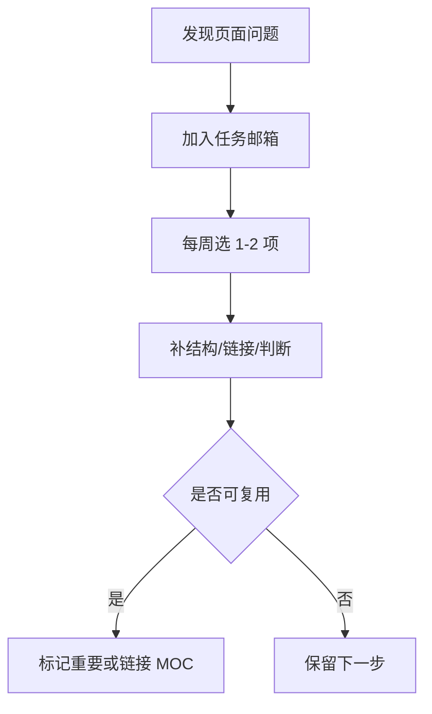

# 任务邮箱

这页模仿 Dusk 的 Page Task 思路：把“页面本身需要处理什么”列出来，而不是只记录普通待办。

新的 Dusk 风格入口见 [[HUB/Tasks]]。

## 页面级任务

| 页面 | 类型 | 当前问题 | 下一步 |
| --- | --- | --- | --- |
| [[10-技术笔记/sd]] | 技术笔记 | 大文件、结构不清 | 拆出标题、来源、用途、附件说明 |
| [[80-Clippings/The End of Coding Andrej Karpathy on Agents, AutoResearch, and the Loopy Era of AI]] | 剪藏 | 原文长，尚未提炼 | 提炼 5 条核心观点并链接 AI 主题地图 |
| [[30-工作/项目/OPC UA 智能监控中心 - 功能总结文档]] | 项目 | 缺项目目标和当前状态摘要 | 补“项目目标/版本/下一步” |

## 任务流

## 使用规则

- 这里只放“页面级任务”，不放零散生活待办。
- 每周处理 1-2 项即可，不追求一次清空。
- 处理完后更新页面本身，再从这里移除或改状态。
