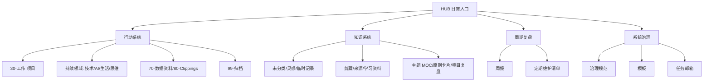

# 全库地图

这页对应 Dusk Vault 的 Map of Content 思路：不是列出所有文件，而是解释“从一个问题出发应该去哪里”。

新的 Dusk 风格入口见 [[HUB/Map]]。

## 四层结构

## 问题入口

| 我现在想做什么 | 入口 | 产出 |
| --- | --- | --- |
| 快速记一条东西 | [[未分类/收件箱处理台]] | 临时记录或待整理任务 |
| 找当前项目 | [[30-工作/项目/00-项目总览]] | 下一步、资料和复盘 |
| 查命令或技术问题 | [[10-技术笔记/00-索引]] | 命令、场景、踩坑记录 |
| 跟踪 AI 变化 | [[20-AI/AI日记/Topics/00-AI主题地图]] | 主题判断和日报链接 |
| 整理长文剪藏 | [[80-Clippings/剪藏处理台]] | 摘要、观点、主题链接 |
| 写长期思考 | [[60-思维笔记/00-思维主题地图]] | 问题、判断、应用 |
| 检查系统是否健康 | [[00-管理/任务邮箱]] | 页面级任务和维护动作 |

## 成熟路径

每篇笔记不必一开始就完整，但应该知道自己处在哪个阶段。
