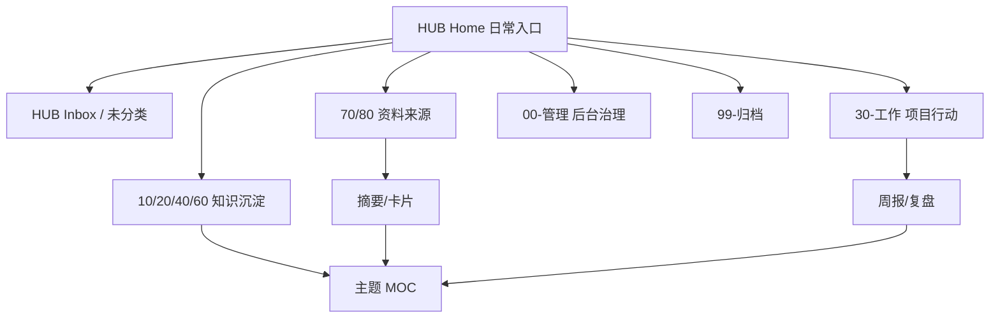

# 知识库优化路线图

## 当前混乱来源

这个库已经有结构，但入口层级偏多：根 README、管理索引、标签仪表盘、分区索引、历史整理文档都在承担“导航”职责。用户实际使用时容易不知道该从哪个页面开始。

另一个问题是内容成熟度混在一起：项目、速查表、剪藏、主题占位、治理文档都已经归档到分区，但还没有稳定区分“收集、整理、沉淀、复用”四种状态。

## 借鉴案例

| 案例/方法                                                                                                                                                                              | 可借鉴点                                    | 对本库的落地方式                                             |
| ---------------------------------------------------------------------------------------------------------------------------------------------------------------------------------- | --------------------------------------- | ---------------------------------------------------- |
| [Linking Your Thinking / MOC](https://www.linkingyourthinking.com/)                                                                                                                | 用主题地图连接笔记，而不是只靠文件夹                      | 建设 `知识库工作台` 和每个高价值主题 MOC                             |
| [Dusk Obsidian Vault](https://github.com/DuskWasHere/dusk-obsidian-vault)                                                                                                          | PARA 与 Zettelkasten 混合，提供主页、地图、收件箱和任务追踪 | 保留现有编号目录，但明确 `30-工作` 是项目行动区                          |
| [Zettelkasten in Obsidian](https://obsidian.rocks/getting-started-with-zettelkasten-in-obsidian/)                                                                                  | 临时记录逐步加工成可复用笔记                          | 给剪藏、AI 日记、思维主题增加“个人判断”和“相关链接”                        |
| [Obsidian Properties](https://help.obsidian.md/properties) / [Tags](https://help.obsidian.md/tags)                                                                                 | 用结构化属性和标签支持检索                           | frontmatter 只保留 `type/domain/status/tags/date` 等稳定字段 |
| [Backlinks](https://help.obsidian.md/plugins/backlinks) / [Outgoing links](https://help.obsidian.md/plugins/outgoing-links) / [Graph view](https://help.obsidian.md/plugins/graph) | 发现未链接内容、反向关系和主题网络                       | 每周维护时检查孤岛笔记和未链接提及                                    |

详细差距见：[[00-管理/Dusk 对标差距]]。

## 推荐结构

不建议继续大规模移动文件。当前编号结构已经足够稳定，下一步应该做“入口收敛”：

## 三阶段优化

### 第一阶段：入口收敛

- [x] 把 [[HUB/Home]] 设为日常主入口，[[00-管理/知识库工作台]] 降为后台整理入口。
- [x] 增加 [[00-管理/全库地图]]、[[00-管理/任务邮箱]] 和 [[未分类/收件箱处理台]]。
- [x] README 只保留全库说明和链接，不再承担所有日常操作。
- [x] 管理索引只保留治理、清单、配置和审查入口。

### 第二阶段：主题 MOC

- [x] 为 `AI Topics` 增加一个总主题地图。
- [x] 为 `个人软件实现` 和 `工作软件实现` 建立项目群视图。
- [x] 把 `书法/英语/军事/道法术器` 逐步整理成思维主题地图。

### 第三阶段：内容提炼

- [ ] 处理 `sd.md`，拆成可阅读结构或拆出附件。
- [x] 为 `80-Clippings` 增加剪藏处理台。
- [ ] 为 `80-Clippings` 的长文剪藏补摘要和个人判断。
- [ ] 从知识库五章中提炼 5-10 张原则卡片。

### 第四阶段：复用与输出闭环

- [x] 增加 [[HUB/Outputs]]，把高价值笔记连接到文章、方案、SOP、Permanent Note 或提示词资产。
- [x] 增加 [[HUB/Review]]，只复习能重新带回行动的高价值笔记。
- [x] 增加 [[20-AI/AI提示词库/90-来源与维护/提示词使用记录]]，用真实任务效果判断提示词资产。
- [x] 增加 [[Templates/原生模板/决策记录模板]]，记录重要项目、治理和资产取舍的原因。
- [x] 增加 [[00-管理/恢复演练与隐私检查]]，补齐备份恢复、插件恢复、脱敏和外部 AI 使用边界。
- [ ] 首轮从 [[HUB/Outputs]] 推进一个候选成果。
- [ ] 首轮从 [[HUB/Review]] 复习 3 条高价值笔记。
- [ ] 首轮在 [[20-AI/AI提示词库/90-来源与维护/提示词使用记录]] 记录一次真实使用效果。

## 不建议做的事

- 不建议继续新增很多文件夹。
- 不建议为每个小概念都提前创建空 MOC。
- 不建议给每篇笔记打很多细标签。
- 不建议把剪藏直接当成知识沉淀。
