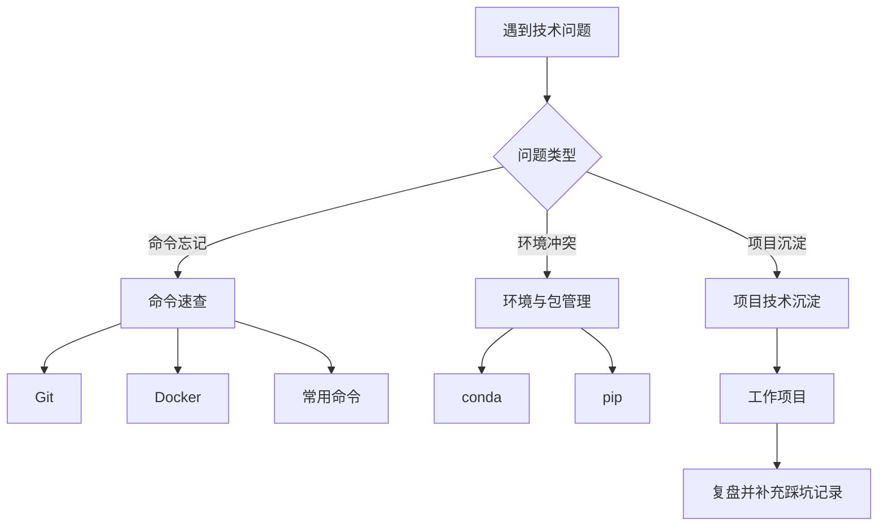

# 10-技术笔记索引

技术笔记区用于保存命令速查、环境管理、工具配置、工程问题和项目相关技术沉淀。新增技术笔记时，优先补充适用场景、关键命令、踩坑记录和相关项目链接。

## 命令速查

- [[🚀 pip 常用命令速查表]]
- [[🚀 conda 常用命令速查表]]
- [[🐳 Docker 命令速查表]]
- [[🖋 Vim 命令速查表]]
- [[📝 Nano 编辑器速查手册]]
- [[常用命令记录]]

## 环境与工具

- [[Conda 包管理工具使用指南]]
- [[🌱 环境管理最佳实践（conda + pip）]]
- [[Git 常用命令与常见问题处理]]
- [[Obsidian 数据同步]]
- [[docker打包整个python环境]]

## 项目技术沉淀

- [[【智能监盘】-ICS工程组态：基于PyQt一键自动生成组态画面指南]]
- [[sd]]

## 技术笔记使用路径

## 维护建议

- `sd.md` 体积较大且包含嵌入图片，后续建议提取附件并整理成结构化说明。
- 命令速查类笔记建议统一为“场景 -> 命令 -> 说明 -> 注意事项”。
- 与工作项目强相关的技术笔记，应补充到对应项目笔记的反向链接。
