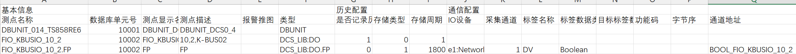

---
type: 笔记
domain: 技术
status: 待整理
tags:
  - 领域/技术
  - 类型/笔记
  - 待整理
---

# KBUSCNVT 转换与开关量测点配置记录

## 快速摘要

- 这篇笔记解决什么问题：把 `KBUSCNVT` sheet、`Dbunit.csv` 和 FIO KBUS IO 文件之间的字段关系整理清楚，支撑开关量测点配置转换。
- 最有用的结论：`PN` 对应测点名称，`LOC_DS` 对应测点显示名称，IO 设备命名规则为 `e1:网络名称:设备名称_BOOL`。
- 后续复用场景：OPC UA 智能监控中心、工作软件转换工具、现场测点批量生成 demo 配置。

## 相关入口

- [[10-技术笔记/00-索引]]
- [[30-工作/项目/OPC UA 智能监控中心 - 功能总结文档]]
- [[30-工作/项目/工作软件实现]]

## 用途

记录 KBUSCNVT sheet、`Dbunit.csv` 和 FIO KBUS IO 文件之间的字段对应关系，用于把现场测点转换为 demo 可识别的开关量配置。

## 当前结论

- 本轮先实现 `KBUSCNVT` 的转换逻辑，并以长青项目的实际数据作为例子。
- `Dbunit.csv` 中的测点名称对应 `KBUSCNVT` sheet 页里的 `PN` 字段。
- `Dbunit.csv` 中的测点显示名称对应 `KBUSCNVT` sheet 页里的 `LOC_DS` 字段。
- IO 设备只存在于 `FIO_KBUSIO_10_2.FP` 中。
- IO 设备命名规则为 `e1:网络名称:设备名称_BOOL`。
- 其他数值暂时沿用 demo 默认值。

## 待确认

- `KBUSCNVT` 转换后的目标文件格式和生成位置。
- `FIO_KBUSIO_10_2.FP` 是否只覆盖开关量，还是后续还要处理模拟量。
- `Dbunit.csv` 中是否存在重复测点名称，若存在需要确定冲突处理规则。
- demo 默认值中哪些字段可以长期固定，哪些字段需要从现场数据补齐。

## 相关项目

- [[30-工作/项目/OPC UA 智能监控中心 - 功能总结文档]]
- [[30-工作/项目/工作软件实现]]

## 原始记录

这存在问题，我们先实现KBUSCNVT的转化  重新更新了demo  我以长青实际举例，  开关量示例  Dbunit.csv内容如下   sheet页KBUSCNVT  PN对应Dbunit.csv中的测点名称  LOC_DS对应Dbunit.csv中的测点显示名称  IO设备只在FIO_KBUSIO_10_2.FP中存在命名规则为e1:网络名称:设备名称_BOOL     Dbunit_UDP.csv  sheet页KBUSCNVT  LOC_DS对应Dbunit_UDP.csv中红框的列名为值的内容  SN则为PN点名对应Dbunit_UDP.csv中红框的列名为值的内容    其他的数值为demo中默认值
