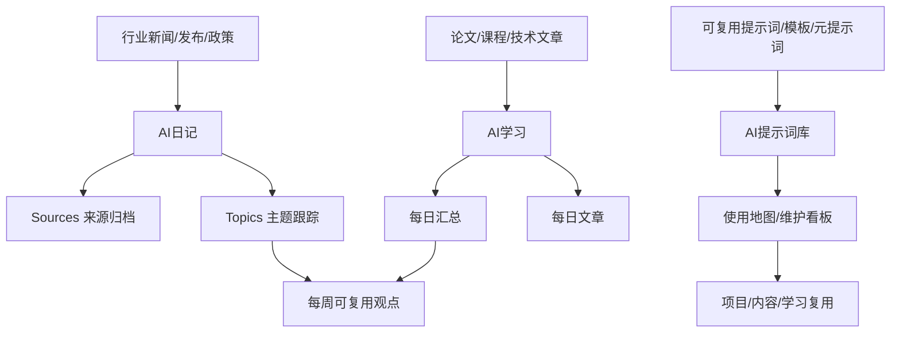

# 20-AI 索引

## 这个分区负责什么

这里是 AI 相关内容的统一入口，包含学习资料、行业日记和提示词资产三个子系统。学习资料负责理解技术，行业日记负责跟踪变化，提示词库负责沉淀可复用工具。

## 核心入口

- [[20-AI/AI学习/00-索引|AI学习]]：论文、文章摘要、每日学习汇总。
- [[20-AI/AI日记/00-索引|AI日记]]：AI 行业日报、来源归档、主题跟踪。
- [[20-AI/AI日记/Topics/00-AI主题地图|AI主题地图]]：长期主题、公司线索和趋势判断总入口。
- [[20-AI/AI提示词库/00-索引|AI提示词库]]：通用提示词、元提示词、内容/营销/工作模板和使用地图。

## 重点内容

- `AI学习`：更适合保存论文、课程和技术文章。
- `AI日记`：更适合保存行业变化、来源和每日追踪。
- `Topics`：更适合保存长期主题判断。
- `AI提示词库`：更适合保存可复用提示词、提示词工程方法和跨项目模板。

## 子模块边界

| 子模块 | 放什么 | 不放什么 |
| --- | --- | --- |
| `AI学习` | 论文、课程、技术文章、学习摘要 | 没有学习目标的行业新闻 |
| `AI日记` | 行业事件、来源归档、公司和政策主题跟踪 | 可复制复用的 Prompt 正文 |
| `AI提示词库` | 可复用 Prompt、提示词方法论、评估清单和维护看板 | 普通 AI 观察、日报、论文摘要 |
| `Topics` | 长期主题判断、趋势线索和公司/政策/算力主线 | 单日事实堆叠 |

## 内容流向图

## 整理规则

1. 日常新闻进入 `AI日记`。
2. 论文和学习摘要进入 `AI学习`。
3. 可复用提示词、元提示词和通用模板进入 `AI提示词库`。
4. 重要主题沉淀到 `AI日记/Topics` 或后续主题页。
5. 每周从学习和日记中提炼 3-5 条可复用观点。
6. 提示词库按 [[20-AI/AI提示词库/01-使用地图|使用地图]] 找入口，按 [[20-AI/AI提示词库/10-网络精选/24-提示词资产维护看板|提示词资产维护看板]] 做维护，不扩散成全库标签体系。

## AI 内容完成标准

| 内容类型 | 完成标准 |
| --- | --- |
| 日报 | 有事实、来源和主题归属 |
| 来源归档 | 能追溯原始链接或出处 |
| 主题页 | 有趋势判断、关键事件和相关公司/政策/技术链接 |
| 学习笔记 | 有核心概念、适用场景和自己的理解 |
| 提示词资产 | 有用途、变量、输出格式、风险边界、来源或维护记录 |
| 长期判断 | 回流到 [[ZETA/Permanent Notes]] |

## 不放在这里

- 只和个人项目实现有关的提示词或工具配置，放到项目页或 `10-技术笔记`。
- 没有来源的传闻，先放入收件箱并标记待确认。
- 已经形成通用方法论的内容，回链到 `40-知识库` 或 ZETA。

## 相关地图

- [[HUB/Map]]：查看全库结构。
- [[ZETA/00-ZETA]]：查看从来源到永久笔记的沉淀路径。
- [[20-AI/AI提示词库/01-使用地图]]：按任务意图选择提示词。
- [[20-AI/AI提示词库/10-网络精选/24-提示词资产维护看板]]：维护提示词资产质量。

## 自动化

`AI日记` 自动化任务应写入 `E:\Obsidian\20-AI\AI日记`，不再写入旧的根目录 `AI日记`。
