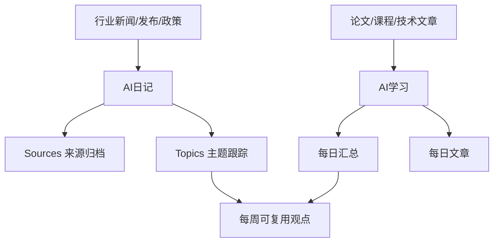

# 20-AI 索引

## 这个分区负责什么

这里是 AI 相关内容的统一入口，包含学习资料和行业日记两个子系统。

## 核心入口

- [[20-AI/AI学习/00-索引|AI学习]]：论文、文章摘要、每日学习汇总。
- [[20-AI/AI日记/00-索引|AI日记]]：AI 行业日报、来源归档、主题跟踪。
- [[20-AI/AI日记/Topics/00-AI主题地图|AI主题地图]]：长期主题、公司线索和趋势判断总入口。

## 重点内容

- `AI学习`：更适合保存论文、课程和技术文章。
- `AI日记`：更适合保存行业变化、来源和每日追踪。
- `Topics`：更适合保存长期主题判断。

## 内容流向图

## 整理规则

1. 日常新闻进入 `AI日记`。
2. 论文和学习摘要进入 `AI学习`。
3. 重要主题沉淀到 `AI日记/Topics` 或后续主题页。
4. 每周从学习和日记中提炼 3-5 条可复用观点。

## 相关地图

- [[HUB/Map]]：查看全库结构。
- [[ZETA/00-ZETA]]：查看从来源到永久笔记的沉淀路径。

## 自动化

`AI日记` 自动化任务应写入 `E:\Obsidian\20-AI\AI日记`，不再写入旧的根目录 `AI日记`。
