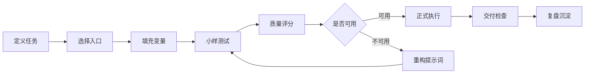

# 提示词实战工作流与复盘系统

## 定位

这页用于把提示词从“收藏”变成“实战资产”。每次使用重要提示词时，都按同一流程记录输入、输出、问题、改法和复用结论。

如果一次失败值得长期保留，应写入 [[20-AI/AI提示词库/10-网络精选/23-失败案例库与修复记录|失败案例库与修复记录]]；如果同类任务反复出现，应沉淀到 [[20-AI/AI提示词库/10-网络精选/22-提示词场景组合包矩阵|提示词场景组合包矩阵]]。

## 标准工作流



## 01-定义任务

先写清楚四件事：

| 问题 | 示例 |
| --- | --- |
| 我要得到什么结果 | 一份可交付的客户调研报告。 |
| 给谁使用 | 销售团队和客户成功团队。 |
| 用什么资料 | 客户访谈、官网、竞品页面、已有工单。 |
| 成功标准是什么 | 能支持下一次客户会议，有证据表和行动建议。 |

## 02-选择入口

| 任务类型 | 优先入口 |
| --- | --- |
| 写提示词 | [[20-AI/AI提示词库/01-提示词工程与逆向/00-索引\|提示词工程与逆向]] |
| 复杂研究 | [[20-AI/AI提示词库/10-网络精选/07-专家级实战提示词\|专家级实战提示词]] |
| 多步骤任务 | [[20-AI/AI提示词库/10-网络精选/08-提示词组合工作流\|提示词组合工作流]] |
| PPT/网页交付 | [[20-AI/AI提示词库/10-网络精选/14-网页PPT生成器拆分模板\|网页PPT生成器拆分模板]] |
| GEO 改写 | [[20-AI/AI提示词库/10-网络精选/13-GEO文章改写拆分模板\|GEO文章改写拆分模板]] |
| 高风险内容 | [[20-AI/AI提示词库/10-网络精选/11-高风险模板使用边界\|高风险模板使用边界]] |

## 03-填充变量

填变量时，不要只填主题，要补齐以下内容：

| 变量 | 必填原因 |
| --- | --- |
| `{{任务目标}}` | 决定输出方向。 |
| `{{目标对象}}` | 决定语言、深度和格式。 |
| `{{原始资料}}` | 降低编造风险。 |
| `{{限制条件}}` | 避免越界和跑偏。 |
| `{{输出格式}}` | 便于下一步使用。 |
| `{{验收标准}}` | 判断结果能否交付。 |

## 04-小样测试

正式执行前先跑小样：

1. 只给 20%-30% 的资料。
2. 要求模型输出短版。
3. 检查方向、结构、证据和格式。
4. 发现问题先改提示词，不要继续堆资料。

## 05-质量评分

用 [[20-AI/AI提示词库/10-网络精选/16-提示词质量评分矩阵|提示词质量评分矩阵]] 给提示词和输出各打一次分：

| 对象 | 低于多少必须修改 | 重点看 |
| --- | ---: | --- |
| 提示词 | 70 | 目标、变量、风险边界、输出格式。 |
| 模型输出 | 75 | 准确性、完整性、可执行性、格式。 |
| 高风险输出 | 85 | 事实依据、免责声明、人工复核点。 |

## 06-复盘模板

```markdown
## 提示词实战复盘

- 日期：
- 任务名称：
- 使用提示词：
- 适用模型：
- 输入资料：
- 输出用途：

### 结果判断

- 是否可交付：
- 总分：
- 最大问题：

### 失败或不足

| 问题 | 原因 | 修改策略 |
| --- | --- | --- |

### 有效做法

- 

### 下一版提示词改法

- 

### 是否沉淀

- [ ] 进入主用模板
- [ ] 改写后再用
- [ ] 只做灵感
- [ ] 归档
```

## 07-失败类型诊断

| 失败类型 | 识别方式 | 下一步 |
| --- | --- | --- |
| 目标失败 | 输出方向不对 | 重写任务目标和成功标准。 |
| 上下文失败 | 编造背景或误解对象 | 补资料和禁止假设规则。 |
| 格式失败 | 没按表格/JSON/结构输出 | 加 schema 和输出示例。 |
| 证据失败 | 结论没有来源 | 加证据表和“资料不足”规则。 |
| 风险失败 | 出现专业误导或侵权 | 加 warning、风险标签和人工复核。 |
| 交付失败 | 结果不可执行 | 加下一步、负责人、时间和验收标准。 |
| 成本失败 | 提示词太长或输出太散 | 拆分模板或缩小任务范围。 |

## 08-沉淀规则

| 实战结果 | 沉淀动作 |
| --- | --- |
| 连续 3 次成功 | 升为主用模板，补到使用地图。 |
| 常规可用，边界失败 | 保留为 A级，补边界样例。 |
| 经常跑偏 | 进入重构清单。 |
| 风险过高 | 移入高风险边界页。 |
| 只适合某次任务 | 项目内归档，不进主库。 |

## 最小闭环

每次重要使用后，至少记录三句话：

1. 这条提示词在哪个任务上有效。
2. 它失败在哪里。
3. 下一次要改哪个变量、规则或输出格式。

## 维护出口

- 失败案例集中记录到 [[20-AI/AI提示词库/10-网络精选/23-失败案例库与修复记录|失败案例库与修复记录]]。
- 周/月度维护使用 [[20-AI/AI提示词库/10-网络精选/24-提示词资产维护看板|提示词资产维护看板]]。
