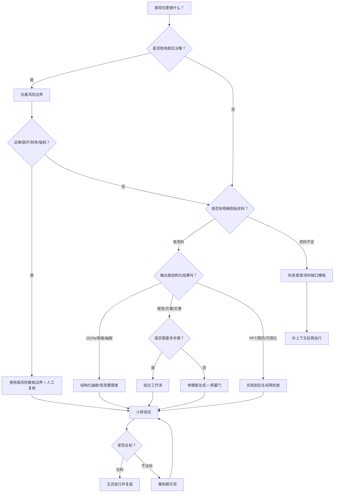

# 提示词选择决策树

## 定位

这页解决一个实际问题：任务来了以后，到底该用哪一类提示词。不要从模板标题开始找，要从任务风险、输入资料、输出用途和交付标准开始判断。

## 快速决策图



## 第一判断：任务风险

| 如果任务涉及 | 先看 | 使用原则 |
| --- | --- | --- |
| 法律、合同、合规 | [[20-AI/AI提示词库/10-网络精选/11-高风险模板使用边界|高风险模板使用边界]] | 只做草案、清单和风险提示，必须人工专业审阅。 |
| 医疗、健康、用药 | [[20-AI/AI提示词库/10-网络精选/11-高风险模板使用边界|高风险模板使用边界]] | 只做信息整理和科普，不做诊断、治疗或用药建议。 |
| 财务、投资、收益 | [[20-AI/AI提示词库/10-网络精选/11-高风险模板使用边界|高风险模板使用边界]] | 不承诺收益，不做个性化投资建议。 |
| 版权、仿写、逆向 | [[20-AI/AI提示词库/10-网络精选/11-高风险模板使用边界|高风险模板使用边界]] | 只学习结构和方法，不复刻表达、视觉或案例。 |
| 事实研究、企业调研 | [[20-AI/AI提示词库/10-网络精选/07-专家级实战提示词|专家级实战提示词]] | 必须有来源、证据表和“资料不足以判断”。 |

## 第二判断：输入资料

| 输入状态 | 推荐动作 |
| --- | --- |
| 只有一句模糊需求 | 先让模型提澄清问题，不直接生成。 |
| 有资料但很乱 | 用信息整理、内容梳理或长上下文压缩。 |
| 有结构化数据 | 用抽取、分类、表格洞察、校验类提示词。 |
| 有多份材料 | 用综合、对比、证据表、冲突检查。 |
| 有图片/视频/网页 | 先做事实描述，再做结构分析，最后再生成。 |
| 有代码/报错 | 先定位根因和最小复现，再给修复方案。 |

## 第三判断：输出用途

| 输出用途 | 优先模板方向 |
| --- | --- |
| 直接交付客户或团队 | 先生成，再用最终交付质量门检查。 |
| 自己学习理解 | 用学习教练、关键词学习、苏格拉底追问。 |
| 生成文章内容 | 先大纲，再正文，再事实和风格检查。 |
| 做 PPT/网页 | 先内容梳理，再页面规划，再视觉设定，再检查。 |
| 做技术方案 | 先约束和权衡，再实现计划，再测试清单。 |
| 做营销/GEO | 先事实台账，再结构重构，不承诺流量结果。 |
| 建知识库 | 先抽取原子知识，再建立链接和适用场景。 |

## 任务到入口映射

| 任务 | 推荐入口 | 不推荐做法 |
| --- | --- | --- |
| 不知道提示词好不好 | [[20-AI/AI提示词库/10-网络精选/16-提示词质量评分矩阵|提示词质量评分矩阵]] | 只凭一次输出判断。 |
| 提示词很长很乱 | [[20-AI/AI提示词库/10-网络精选/17-提示词重构标准操作法|提示词重构标准操作法]] | 继续往原提示词里加规则。 |
| 任务需要多步执行 | [[20-AI/AI提示词库/10-网络精选/08-提示词组合工作流|提示词组合工作流]] | 用一个巨大提示词包办所有步骤。 |
| 需要记录实战效果 | [[20-AI/AI提示词库/10-网络精选/18-提示词实战工作流与复盘系统|提示词实战工作流与复盘系统]] | 用完就丢，不记录失败。 |
| 要整理成标准笔记 | [[20-AI/AI提示词库/10-网络精选/20-提示词卡片标准模板|提示词卡片标准模板]] | 只保存 Prompt 正文。 |
| 发现提示词味道不对 | [[20-AI/AI提示词库/10-网络精选/21-提示词反模式与修复手册|提示词反模式与修复手册]] | 盲目相信“专家/爆款/一键”。 |

## 快速选择提示词

```markdown
你是提示词路由员。请根据我的任务，判断应该使用哪一类提示词，而不是直接完成任务。

我的任务：
{{任务描述}}

已有资料：
{{资料状态}}

输出用途：
{{交付对象和用途}}

风险限制：
{{法律/医疗/财务/版权/隐私/事实核查等限制}}

请输出：
1. 推荐使用的提示词类型。
2. 推荐入口页面或模板。
3. 必须先补充的输入变量。
4. 是否属于高风险任务。
5. 小样测试应该怎么设计。
6. 不推荐使用的模板类型及原因。
```

## 最小使用规则

1. 高风险先看边界，不直接生成。
2. 资料不足先问问题，不硬写。
3. 多步骤任务先拆流程，不用一个巨大 Prompt。
4. 重要交付必须小样测试。
5. 失败后先改提示词，不继续堆上下文。
