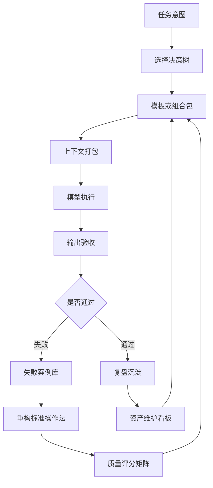

# 提示词检索导航与知识图谱

## 定位

这页用于解决“提示词越来越多以后怎么找”的问题。检索不应该只靠文件名，而要结合任务意图、风险等级、输出类型、适用模型、使用状态和失败记录。

## 五种检索路径

| 路径 | 适合问题 | 入口 |
| --- | --- | --- |
| 按任务找 | 我现在要做什么？ | [[20-AI/AI提示词库/01-使用地图|AI提示词使用地图]] |
| 按场景找 | 这个任务要串哪些模板？ | [[20-AI/AI提示词库/10-网络精选/22-提示词场景组合包矩阵|提示词场景组合包矩阵]] |
| 按质量找 | 哪些模板值得优先用？ | [[20-AI/AI提示词库/10-网络精选/09-提示词质量分级与整改清单|提示词质量分级与整改清单]] |
| 按风险找 | 有没有法律/医疗/版权风险？ | [[20-AI/AI提示词库/10-网络精选/11-高风险模板使用边界|高风险模板使用边界]] |
| 按维护找 | 哪些模板要升级/降级？ | [[20-AI/AI提示词库/10-网络精选/24-提示词资产维护看板|提示词资产维护看板]] |

## 推荐搜索词

| 想找 | 搜索词 |
| --- | --- |
| 高质量主用模板 | `quality: S`、`S级`、`最终交付质量门` |
| 风险模板 | `风险级/`、`warning`、`使用边界` |
| 可直接复制模板 | `## Prompt`、`Prompt：` |
| 可维护模板 | `测试样例`、`版本记录`、`输入变量` |
| 失败案例 | `失败类型`、`根因判断`、`修复动作` |
| 模型迁移 | `模型适配`、`迁移记录` |
| 资料处理 | `上下文包`、`资料编号`、`待核实` |

## 知识图谱关系



## 页面关系表

| 页面 | 上游 | 下游 |
| --- | --- | --- |
| 选择决策树 | 使用地图 | 模板/组合包 |
| 场景组合包矩阵 | 选择决策树 | 复盘系统 |
| 上下文打包规范 | 资料源 | 模型执行 |
| 输出验收清单 | 模型输出 | 失败案例库/复盘系统 |
| 失败案例库 | 输出验收 | 重构标准操作法 |
| 重构标准操作法 | 失败案例 | 质量评分矩阵 |
| 质量评分矩阵 | 重构结果 | 元数据与测试样例集 |
| 资产维护看板 | 复盘记录 | 使用地图/索引 |

## Obsidian 使用建议

1. 常用入口加星：`01-使用地图`、`10-网络精选/00-索引`、`19-提示词选择决策树`。
2. 用反向链接查看某个治理页被哪些模板引用。
3. 用标签搜索高风险模板：`风险级/法律`、`风险级/版权`。
4. 用全文搜索 `待补充` 找资料不足的模板。
5. 用全文搜索 `deprecated` 找需要替换的旧模板。

## 检索提示词

```markdown
你是提示词库导航员。请根据我的任务，告诉我应该从哪些页面开始查找，并给出检索关键词。

任务：
{{任务描述}}

我已有资料：
{{资料状态}}

输出用途：
{{输出用途}}

请输出：
1. 最推荐的入口页面。
2. 需要查看的 3-5 个相关页面。
3. 建议搜索词。
4. 是否涉及高风险页面。
5. 是否需要组合包。
6. 是否需要记录失败案例或复盘。
```

## 维护建议

当新增一个治理页或模板页时，至少更新：

1. [[20-AI/AI提示词库/10-网络精选/00-索引|网络精选提示词]]
2. [[20-AI/AI提示词库/01-使用地图|AI提示词使用地图]]
3. [[20-AI/AI提示词库/10-网络精选/10-模板元数据与测试样例集|模板元数据与测试样例集]]
4. 相关上游或下游页面的“延伸维护/回退规则/入口”部分。
