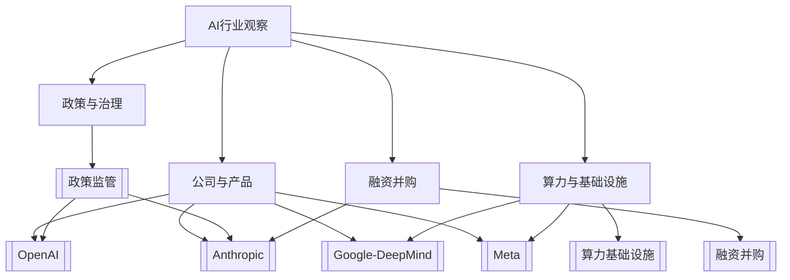

# AI主题地图

这页负责把 AI 日记中的公司、政策、资本和基础设施线索串起来。日报记录当天事实，主题页沉淀长期判断。

## 总览图

## 主题入口

| 主题 | 观察重点 | 入口 |
| --- | --- | --- |
| OpenAI | 产品、安全、平台、政府合作 | [[OpenAI]] |
| Anthropic | 模型治理、安全政策、政府关系 | [[Anthropic]] |
| Google / DeepMind | Gemini 分发、云、终端入口、基础设施 | [[Google-DeepMind]] |
| Meta | 开源生态、组织调整、算力投入 | [[Meta]] |
| 政策监管 | 军方采用、合规边界、治理框架 | [[政策监管]] |
| 算力基础设施 | 数据中心、电力、芯片、云资源 | [[算力基础设施]] |
| 融资并购 | 估值、资本、并购、绑定式投资 | [[融资并购]] |

## 每周提炼问题

- 本周 AI 竞争的主线是模型能力、产品分发、治理可信度，还是基础设施？
- 哪些新闻只是事件，哪些已经形成长期趋势？
- 哪些公司动作会影响工作、学习或工具选择？
- 哪些主题值得从日报升级成独立主题卡片？
