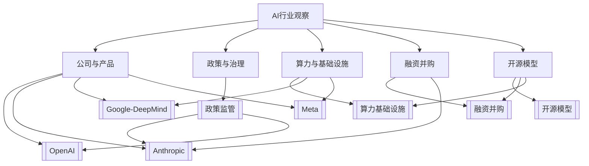

# AI主题地图

这页负责把 AI 日记中的公司、政策、资本和基础设施线索串起来。日报记录当天事实，主题页沉淀长期判断。

## 总览图

## 主题入口

| 主题 | 观察重点 | 入口 |
| --- | --- | --- |
| OpenAI | 产品、安全、平台、政府合作 | [[OpenAI]] |
| Anthropic | 模型治理、安全政策、政府关系 | [[Anthropic]] |
| Google / DeepMind | Gemini 分发、云、终端入口、基础设施 | [[Google-DeepMind]] |
| Meta | 开源生态、组织调整、算力投入 | [[Meta]] |
| 政策监管 | 军方采用、合规边界、治理框架 | [[政策监管]] |
| 算力基础设施 | 数据中心、电力、芯片、云资源 | [[算力基础设施]] |
| 融资并购 | 估值、资本、并购、绑定式投资 | [[融资并购]] |
| 开源模型 | 开放权重、许可、推理栈、私有化部署 | [[开源模型]] |

## 代理工作流观察

- [[80-Clippings/The End of Coding Andrej Karpathy on Agents, AutoResearch, and the Loopy Era of AI]]：代理工作流、AutoResearch、AI 时代技能和教育形态的长转录提炼。
- 观察重点：人类从执行者转向任务拆分者、代理调度者和验收者；后续可根据材料量决定是否单独建立代理工作流主题页。

## 每周提炼问题

- 本周 AI 竞争的主线是模型能力、产品分发、治理可信度，还是基础设施？
- 哪些新闻只是事件，哪些已经形成长期趋势？
- 哪些公司动作会影响工作、学习或工具选择？
- 哪些主题值得从日报升级成独立主题卡片？

## 日报升级标准

| 日报内容 | 升级去向 |
| --- | --- |
| 单日新闻，没有后续影响 | 保留在日报 |
| 连续出现 3 次以上的公司动作 | 对应公司主题页 |
| 影响工具选择或工作方式 | 项目页或技术笔记 |
| 涉及监管、安全、算力、资本长期变量 | 对应主题页 |
| 形成自己的判断 | [[ZETA/Permanent Notes]] |

## 每周输出

- 一条行业主线判断。
- 一个值得继续跟踪的主题。
- 一个会影响自己工作或学习的动作建议。
