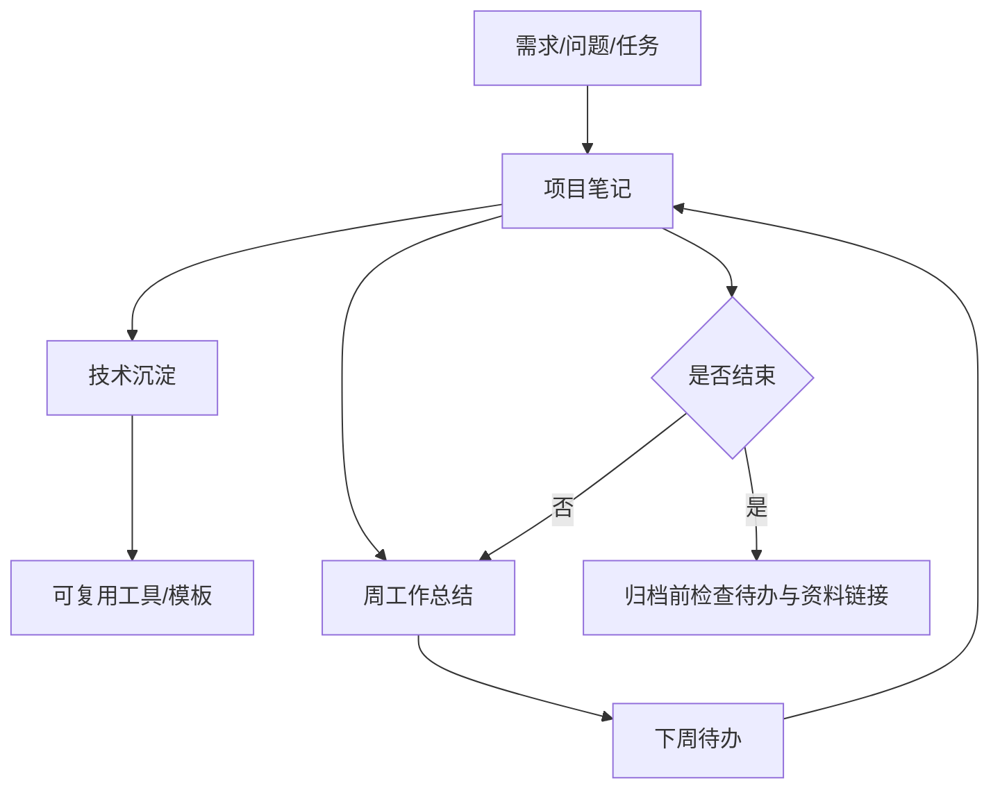

# 30-工作索引

工作区用于保存项目文档、周工作总结、会议记录和工作产出。新增工作笔记时，优先明确项目、状态、下一步和相关资料。

## 项目

- [[30-工作/项目/00-项目总览|项目总览]]
- [[30-工作/项目/OPC UA 智能监控中心 - 功能总结文档]]
- [[30-工作/项目/个人软件实现]]
- [[30-工作/项目/工作软件实现]]

## 周工作总结

- [[30-工作/周工作总结/2025-08-11——2025-08-15]]

## 工作流转图

## 会议记录

当前 `会议记录` 目录为空。后续会议笔记建议使用统一结构：

- 会议主题
- 时间和参与人
- 决策
- 待办
- 相关项目

## 维护建议

- 项目笔记建议使用 `状态/进行中`、`状态/已完成` 或 `状态/归档`。
- 周总结应链接到当周涉及的项目笔记。
- 完成项目归档前，先确认待办已关闭或转移。
