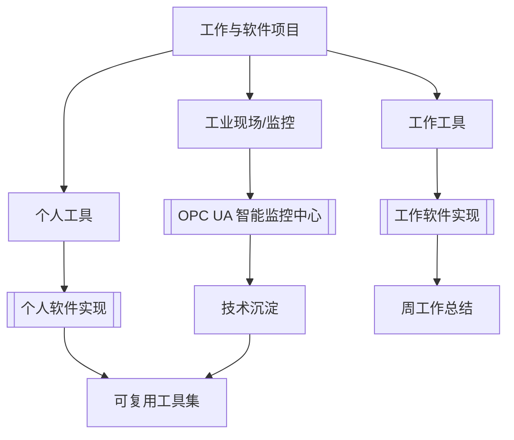

# 项目总览

这页用于管理工作和个人软件项目，重点看状态、下一步和可复用沉淀。

## 项目关系图

## 当前项目

| 项目 | 类型 | 状态 | 下一步 |
| --- | --- | --- | --- |
| [[OPC UA 智能监控中心 - 功能总结文档]] | 工业软件 | 进行中 | 补项目目标、当前版本、待办和相关技术链接 |
| [[工作软件实现]] | 工作效率工具 | 进行中 | 拆出具体工具条目和输入输出规则 |
| [[个人软件实现]] | 个人效率工具 | 进行中 | 给每个构想补使用场景和优先级 |

## 项目笔记标准

每个活跃项目至少保持这些部分：

- 目标：为什么做，解决什么问题。
- 状态：构想、进行中、暂停、已完成、归档。
- 下一步：只写 1-3 个可执行动作。
- 资料：相关技术笔记、代码仓库、会议或周报。
- 复盘：已解决问题、踩坑和可复用经验。
