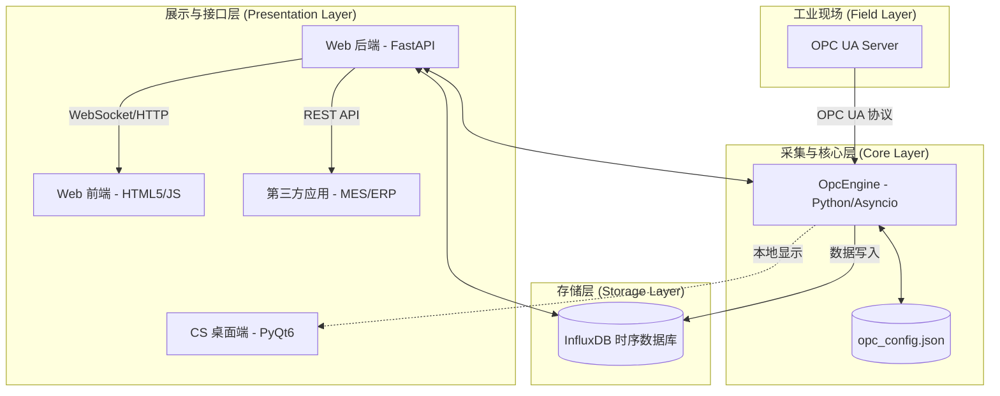
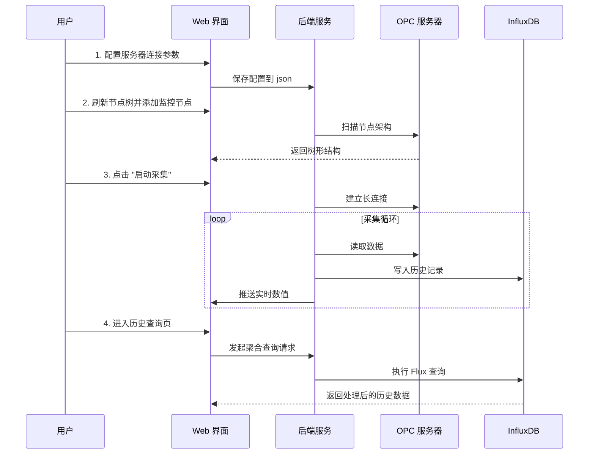

---
type: 项目
domain: 工作
status: 进行中
tags:
  - 领域/工作
  - 类型/项目
  - 状态/进行中
  - OPC-UA
  - 工业软件
---

## 项目目标

建设一个面向工业现场的 OPC UA 智能监控中心，把 OPC UA 节点采集、实时展示、历史存储、查询分析和第三方系统接口打通，形成可部署、可维护、可扩展的监控平台。

## 当前状态

- 已形成核心架构：`OpcEngine` 负责异步采集，InfluxDB 负责时序存储，FastAPI/Web 前端负责展示与接口。
- 已明确主要功能模块：实时仪表盘、节点架构管理、历史数据查询、系统全局设置。
- 当前文档偏功能总结，仍需要补充部署边界、数据字典、异常处理策略和验收标准。

## 下一步

- [ ] 补一页“部署与运行说明”，明确启动顺序、配置文件、端口和依赖服务。
- [ ] 整理 OPC UA 节点字段字典，说明 NodeID、别名、单位、采样频率和写入策略。
- [ ] 补充异常场景：OPC 服务器断开、InfluxDB 写入失败、节点读取超时、配置文件损坏。
- [ ] 给 Web API 增加接口清单，至少覆盖实时状态、历史查询、节点管理和系统配置。
- [ ] 明确 MVP 验收标准：能连接服务器、添加节点、启动采集、写入历史、查询曲线。

## 1. 技术架构 

本系统采用高度解耦的分布式架构，确保了工业现场采集的高可靠性与 Web 端访问的灵活性。

---

## 2. 功能模块 

### 2.1 实时仪表盘 
*   **核心指标**：实时显示读取总次数、写入成功数、写入失败数。
*   **动态流**：通过 WebSocket/轮询技术，实时滚动显示已监控节点的数值变化。
*   **状态感知**：自动识别引擎运行状态及与 OPC 服务器的连接健康度。

### 2.2 节点架构管理
*   **树形浏览**：递归扫描 OPC UA 服务器节点，支持无限层级展示。
*   **批量操作**：支持“一键添加所有变量”及“目录级批量添加”。
*   **别名编辑**：允许用户为复杂的 NodeID 定义友好的中文名称。

### 2.3 历史数据查询 
*   **降采样聚合**：支持按 1m、5m、1h 等时间窗口进行均值聚合，轻松处理万级数据。
*   **灵活筛选**：支持按节点、按相对时间（过去 X 小时/天）进行深度检索。

### 2.4 系统全局设置 
*   **连接配置**：可视化配置 OPC UA 服务器地址、认证信息及采集频率。
*   **存储配置**：InfluxDB 连接参数、Token 及 Bucket 管理。

---

## 3. 数据流程 (Data Flow)

数据在系统中的流转遵循以下路径：

1.  **采集阶段**：`OpcEngine` 根据配置的时间间隔，异步并发读取 OPC UA 服务器节点数据。
2.  **分发阶段**：
    *   **实时路径**：数据进入内存缓冲区，通过 WebSocket 立即推送到 Web 前端。
    *   **持久化路径**：数据被格式化为 InfluxDB Point，批量写入时序数据库。
3.  **消费阶段**：
    *   **前端展示**：用户通过浏览器查看实时跳动的数据。
    *   **历史回溯**：Web 后端响应查询请求，从 InfluxDB 调取数据并进行聚合计算。
    *   **外部集成**：第三方应用通过 `GET /api/history` 接口调取结构化 JSON 数据。

---

## 4. 业务流程

用户操作本系统的典型业务路径如下：

