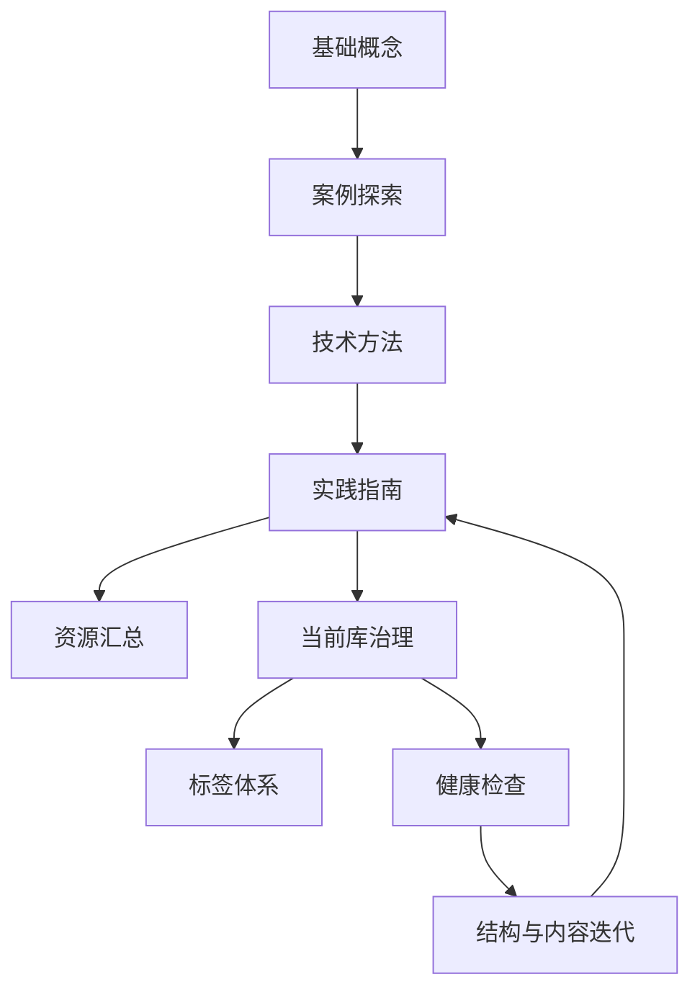

# 40-知识库索引

## 这个分区负责什么

知识库区保存知识管理方法论、案例、技术方法、实践指南和资源汇总。这里是知识管理主题的主入口。

## 核心入口

- [[知识库学习资料 - 目录]]
- [[知识库核心知识与构建方法总结]]：含知识库方法总结和可复用原则卡片。

## 可复用原则入口

| 原则 | 先看哪里 | 用途 |
| --- | --- | --- |
| 入口先于内容 | [[知识库核心知识与构建方法总结#原则到行动]] | 检查首页、地图和后台治理是否分工清楚 |
| 收集、分拣、提炼 | [[ZETA/00-ZETA]]、[[80-Clippings/剪藏处理台]] | 把资料从收藏推进到可复用判断 |
| 规则少而准 | [[00-管理/知识库治理规范]]、[[00-管理/定期维护清单]] | 避免治理文档膨胀成第二套内容库 |
| 补闭环优先于扩目录 | [[ZETA/PERMANENT/知识系统应优先补闭环而不是扩目录]] | 遇到结构扩张冲动时，先判断是否只是缺输出、复习、验证或决策回溯 |
| 人和代理都能读 | [[HUB/Tasks]]、[[00-管理/审查记录/00-索引]] | 把整理动作写成可执行任务和验证记录 |

## 重点内容

- [[第一章：知识宝库的大门 - 基础概念篇]]
- [[第二章：宝库中的珍宝 - 案例探索篇]]
- [[第三章：宝库的建造之道 - 技术方法篇]]
- [[第四章：宝库的守护与进化 - 实践指南篇]]
- [[第五章：知识探险家的工具箱 - 资源汇总篇]]

## 知识库方法地图

## 与当前库治理的关系

- 当前库治理入口：[[00-管理/00-管理索引|00-管理索引]]
- 标签体系说明：[[00-管理/历史整理文档/00-标签体系使用指南]]
- 健康检查模板：[[00-管理/审查记录/知识库健康检查模板|知识库健康检查模板]]

## 使用场景

| 我现在的问题 | 先看哪里 |
| --- | --- |
| 不知道笔记应该放哪里 | [[00-管理/知识库治理规范]] |
| 想理解知识库方法 | [[知识库核心知识与构建方法总结]] |
| 想把方法变成原则卡片 | [[知识库核心知识与构建方法总结#可复用原则卡片]] |
| 想判断是否该新增目录 | [[ZETA/PERMANENT/知识系统应优先补闭环而不是扩目录]] |
| 想找案例和方法论 | 五章资料入口 |
| 想检查当前库质量 | [[00-管理/审查记录/知识库健康检查模板]] |
| 想把方法变成行动 | [[00-管理/定期维护清单]] |

## 整理规则

- 章节内容适合作为长期参考，不建议频繁拆改原文。
- 后续可以从章节中提炼“原则卡片”和“操作清单”，再链接回原章节。
- 新增原则卡片优先汇总到 [[知识库核心知识与构建方法总结]]，避免散落在多个章节里。
- 方法论笔记最终要能服务当前 vault 的使用动作，否则只保留为参考资料。

## 相关地图

- [[HUB/Map]]：查看全库结构。
- [[00-管理/00-管理索引]]：查看当前库治理入口。
