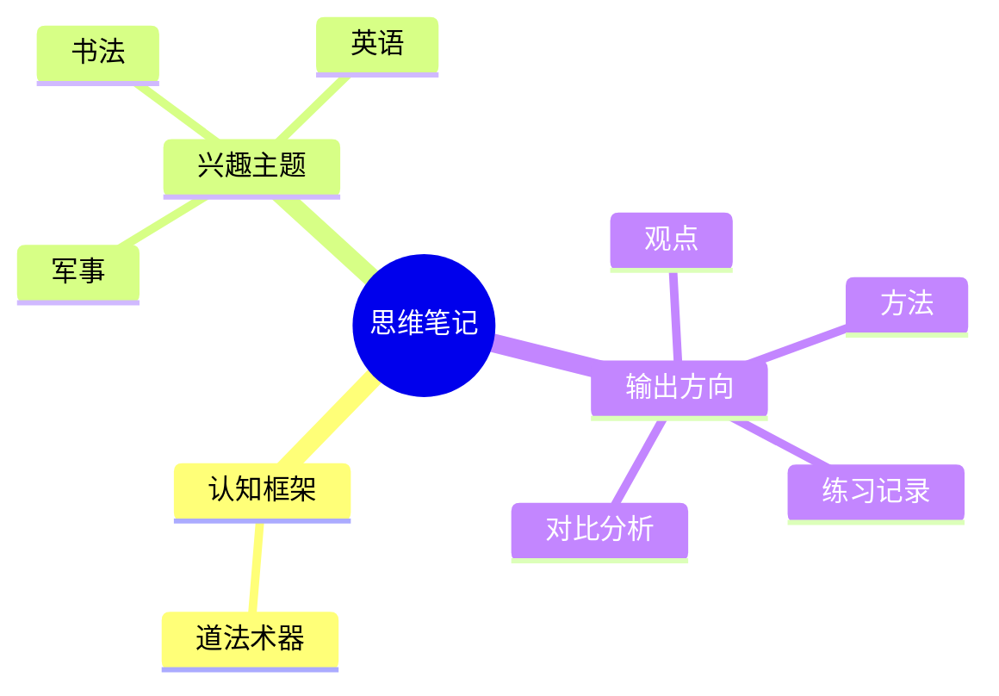

# 思维主题地图

这页负责串联长期兴趣和认知框架。这里不追求一次写完整，而是帮助每个主题持续生长。

## 主题关系图

## 主题入口

| 主题 | 当前状态 | 下一步 |
| --- | --- | --- |
| [[60-思维笔记/认知/道法术器|道法术器]] | 已有结构图 | 补一个现实案例，说明“道法术器”如何循环 |
| [[书法]] | 草稿 | 选择入门字帖，建立练习记录 |
| [[英语]] | 草稿 | 明确目标：考试、工作阅读、口语还是长期输入 |
| [[军事]] | 草稿 | 补 F-22 与 F-35 对比表和资料来源 |

## 写作模板

每个思维主题建议按这四块补齐：

1. 问题：这个主题想回答什么？
2. 资料：可靠来源、案例或观察。
3. 判断：自己的理解，不只摘录。
4. 应用：能如何改变行动、学习或决策。
