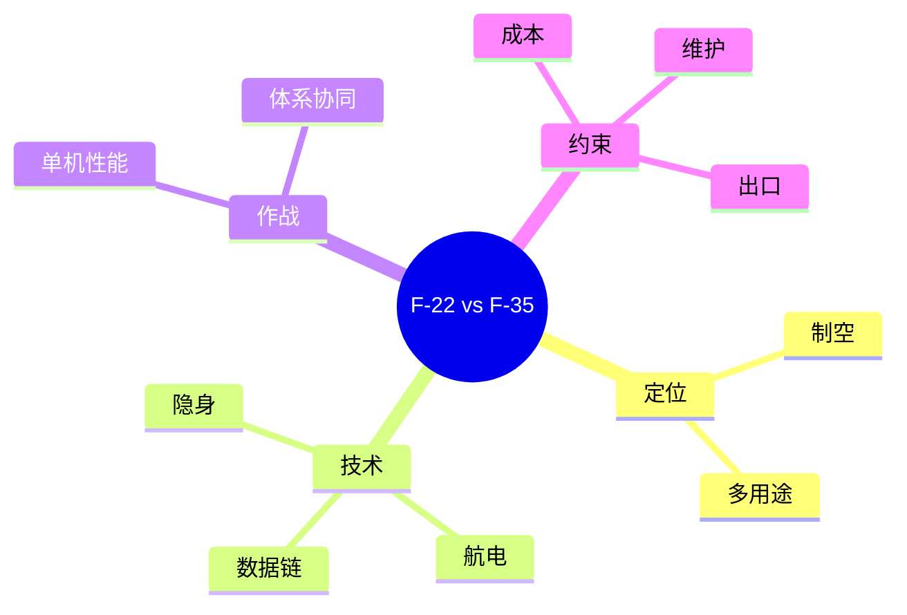

# 军事

## 主题定位

记录军事装备、战略判断、技术路线和历史案例的长期思考。

## 当前线索

- 对比 F-22 与 F-35。
- 从任务定位、隐身设计、航电系统、作战体系和成本维护角度整理差异。

## 分析框架

```mermaid
mindmap
  root((F-22 vs F-35))
    定位
      制空
      多用途
    技术
      隐身
      航电
      数据链
    作战
      单机性能
      体系协同
    约束
      成本
      维护
      出口
```

## 后续补充

- [ ] 补一张 F-22 与 F-35 对比表。
- [ ] 收集权威资料来源。
- [ ] 写出自己的判断：两者分别适合什么作战环境。
