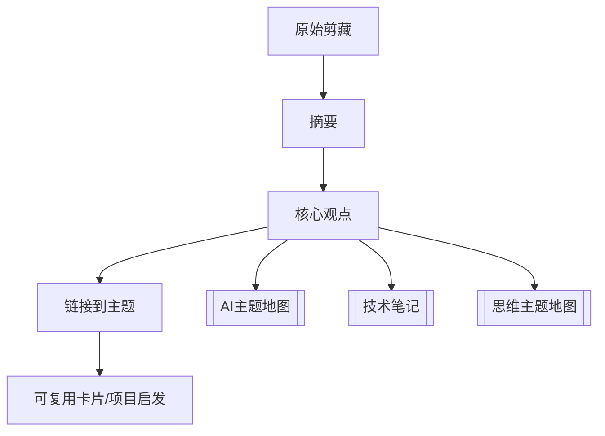

# 剪藏处理台

剪藏区只保存原始材料不够，真正有价值的是提炼后的观点、主题链接和可复用判断。

## 当前材料

| 剪藏 | 类型 | 状态 | 下一步 |
| --- | --- | --- | --- |
| [[The End of Coding Andrej Karpathy on Agents, AutoResearch, and the Loopy Era of AI]] | 播客转录 | 待提炼 | 提炼 Agent 工作流、AutoResearch、AI 时代技能三条主题 |

## 处理流程图



## 提炼模板

复制到每篇剪藏下方或新建摘要页：

```markdown
## 为什么收藏

## 5 条核心观点

## 我自己的判断

## 可复用到哪里

## 相关主题
```

## 本周处理建议

- 先不要继续增加大量剪藏。
- 每周只处理 1 篇长文或转录。
- 每篇只提炼 5-10 条，不追求完整复述。
- 提炼后至少链接到 1 个主题地图或项目页。
