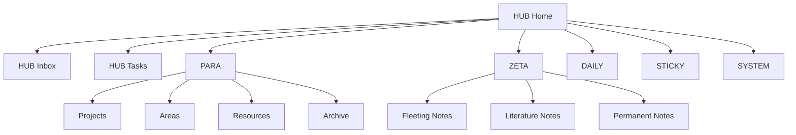

# Vault Map

> [!home]+ Dusk Structure
> [[HUB/Home]] 负责日常行动，本页负责解释全库结构。Dusk 模块是工作流层，编号目录是内容库层。

## 两层结构

| 层级 | 包含目录 | 职责 |
| --- | --- | --- |
| 工作流层 | `HUB`、`PARA`、`ZETA`、`DAILY`、`STICKY`、`SYSTEM` | 决定今天从哪里开始、内容如何流动、系统在哪里维护 |
| 内容库层 | `00-管理`、`10-技术笔记`、`20-AI`、`30-工作`、`40-知识库`、`50-生活`、`60-思维笔记`、`70-数据资料`、`80-Clippings`、`90-Excalidraw`、`99-归档`、`Templates`、`未分类` | 长期保存笔记、资料、模板、项目和归档 |

## Core Modules

> [!hub] HUB
> [[HUB/Home]] · [[HUB/How to Use]] · [[HUB/Inbox]] · [[HUB/Tasks]]
>
> 每天打开的入口层。`Home` 做行动，`Map` 做结构，`How to Use` 做最短路径说明，`Inbox` 做捕获，`Tasks` 做页面级整理。

> [!para] PARA
> [[PARA/Projects]] · [[PARA/Areas]] · [[PARA/Resources]] · [[PARA/Archive]]
>
> 按行动状态管理项目、领域、资源和归档。

> [!zeta] ZETA
> [[ZETA/Fleeting Notes]] · [[ZETA/Literature Notes]] · [[ZETA/Permanent Notes]]
>
> 从临时想法到长期可复用笔记。

> [!daily] DAILY
> [[DAILY/Daily Notes]] · [[DAILY/Weekly Notes]] · [[DAILY/Monthly Notes]]
>
> 周期性记录和复盘。

> [!sticky] STICKY
> [[STICKY/00-STICKY]]
>
> 临时脑暴、草稿和短期想法。

> [!system] SYSTEM
> [[SYSTEM/00-SYSTEM]]
>
> 模板、配置、治理和后台文档；具体规则仍以 [[00-管理/00-管理索引]] 为准。

## Flow

## Workflow To Content Mapping

| 模块 | 用途 | 对应现有内容 |
| --- | --- | --- |
| HUB | 首页、地图、收件箱、任务 | [[首页]]、[[00-管理/任务邮箱]]、[[未分类/收件箱处理台]] |
| PARA | 项目、领域、资源、归档 | `30-工作`、`10/20/50/60`、`70/80`、`99-归档` |
| ZETA | 临时笔记、文献笔记、永久笔记 | `未分类`、`80-Clippings`、主题 MOC |
| DAILY | 日/周/月复盘 | 周报、日记模板、月度总结模板 |
| STICKY | 临时脑暴和草稿 | 未分类、灵感卡片 |
| SYSTEM | 模板、配置、治理 | `00-管理`、`Templates`、`.obsidian` |

## 从问题进入

| 我现在想做什么 | 入口 | 形成什么 |
| --- | --- | --- |
| 快速记一条东西 | [[HUB/Inbox]] | 临时记录或待整理任务 |
| 推进项目 | [[PARA/Projects]] | 下一步、资料和复盘 |
| 查技术资料 | [[10-技术笔记/00-索引]] | 命令、场景和踩坑记录 |
| 跟踪 AI | [[20-AI/AI日记/Topics/00-AI主题地图]] | 主题判断和日报链接 |
| 整理剪藏 | [[80-Clippings/剪藏处理台]] | 摘要、观点和主题链接 |
| 检查系统 | [[00-管理/00-管理索引]] | 治理规则、维护清单和审查记录 |

## 模块健康

最新模块健康记录见 [[00-管理/审查记录/2026-05-10-模块健康检查]]。当前结论是：不新增一级目录，继续用 `HUB / PARA / ZETA / DAILY / SYSTEM` 做工作流层，用编号目录承载正文；`20-AI/AI提示词库` 作为受控资产子模块单独维护元数据兼容规则。
