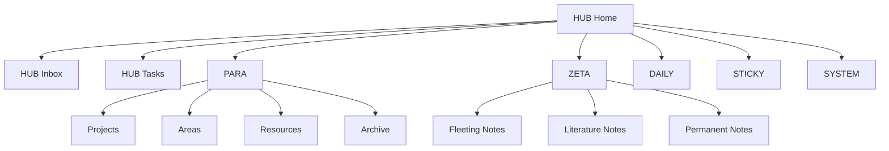

# Vault Map

> [!home]+ Dusk Structure
> 主页负责行动，地图负责理解结构。旧中文目录继续保存内容，新 Dusk 模块负责导航。使用方式见 [[HUB/How to Use]]。

## Core Modules

> [!hub] HUB
> [[HUB/Home]] · [[HUB/Inbox]] · [[HUB/Tasks]]
>
> 每天打开的入口层。

> [!para] PARA
> [[PARA/Projects]] · [[PARA/Areas]] · [[PARA/Resources]] · [[PARA/Archive]]
>
> 按行动状态管理项目、领域、资源和归档。

> [!zeta] ZETA
> [[ZETA/Fleeting Notes]] · [[ZETA/Literature Notes]] · [[ZETA/Permanent Notes]]
>
> 从临时想法到长期可复用笔记。

> [!daily] DAILY
> [[DAILY/Daily Notes]] · [[DAILY/Weekly Notes]] · [[DAILY/Monthly Notes]]
>
> 周期性记录和复盘。

> [!sticky] STICKY
> [[STICKY/00-STICKY]]
>
> 临时脑暴、草稿和短期想法。

> [!system] SYSTEM
> [[SYSTEM/00-SYSTEM]]
>
> 模板、配置、治理和后台文档。

## Flow

## Existing Vault Mapping

| 模块 | 用途 | 对应现有内容 |
| --- | --- | --- |
| HUB | 首页、地图、收件箱、任务 | [[首页]]、[[00-管理/任务邮箱]]、[[未分类/收件箱处理台]] |
| PARA | 项目、领域、资源、归档 | `30-工作`、`10/20/50/60`、`70/80`、`99-归档` |
| ZETA | 临时笔记、文献笔记、永久笔记 | `未分类`、`80-Clippings`、主题 MOC |
| DAILY | 日/周/月复盘 | 周报、日记模板、月度总结模板 |
| STICKY | 临时脑暴和草稿 | 未分类、灵感卡片 |
| SYSTEM | 模板、配置、治理 | `00-管理`、`Templates`、`.obsidian` |
