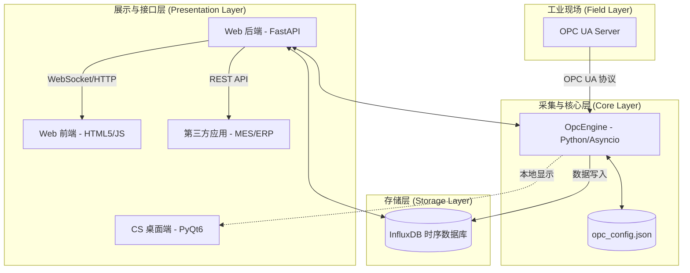
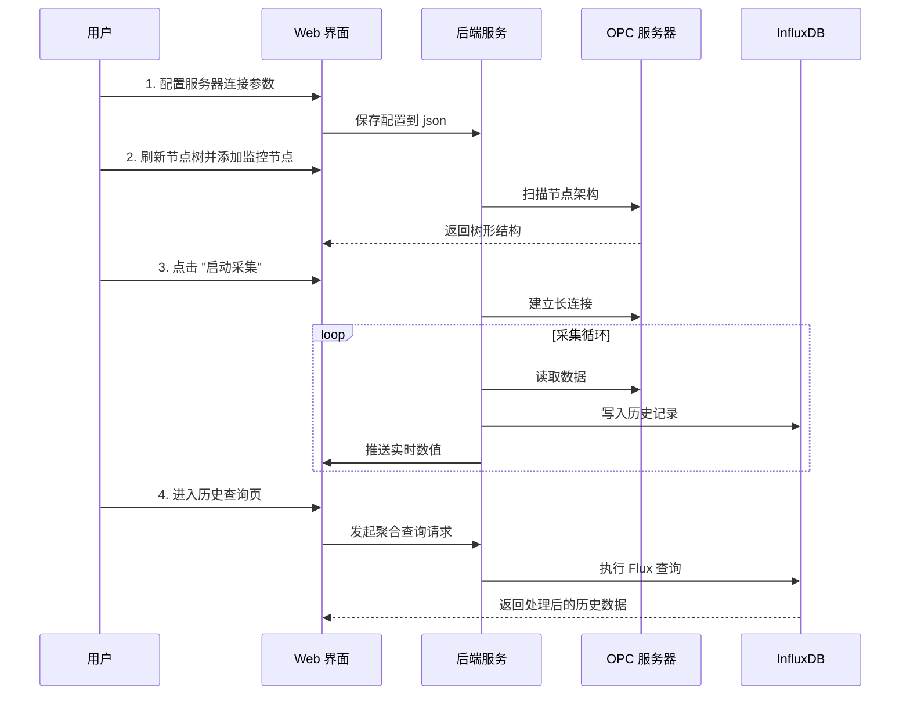

## 1. 技术架构 

本系统采用高度解耦的分布式架构，确保了工业现场采集的高可靠性与 Web 端访问的灵活性。

---

## 2. 功能模块 

### 2.1 实时仪表盘 
*   **核心指标**：实时显示读取总次数、写入成功数、写入失败数。
*   **动态流**：通过 WebSocket/轮询技术，实时滚动显示已监控节点的数值变化。
*   **状态感知**：自动识别引擎运行状态及与 OPC 服务器的连接健康度。

### 2.2 节点架构管理
*   **树形浏览**：递归扫描 OPC UA 服务器节点，支持无限层级展示。
*   **批量操作**：支持“一键添加所有变量”及“目录级批量添加”。
*   **别名编辑**：允许用户为复杂的 NodeID 定义友好的中文名称。

### 2.3 历史数据查询 
*   **降采样聚合**：支持按 1m、5m、1h 等时间窗口进行均值聚合，轻松处理万级数据。
*   **灵活筛选**：支持按节点、按相对时间（过去 X 小时/天）进行深度检索。

### 2.4 系统全局设置 
*   **连接配置**：可视化配置 OPC UA 服务器地址、认证信息及采集频率。
*   **存储配置**：InfluxDB 连接参数、Token 及 Bucket 管理。

---

## 3. 数据流程 (Data Flow)

数据在系统中的流转遵循以下路径：

1.  **采集阶段**：`OpcEngine` 根据配置的时间间隔，异步并发读取 OPC UA 服务器节点数据。
2.  **分发阶段**：
    *   **实时路径**：数据进入内存缓冲区，通过 WebSocket 立即推送到 Web 前端。
    *   **持久化路径**：数据被格式化为 InfluxDB Point，批量写入时序数据库。
3.  **消费阶段**：
    *   **前端展示**：用户通过浏览器查看实时跳动的数据。
    *   **历史回溯**：Web 后端响应查询请求，从 InfluxDB 调取数据并进行聚合计算。
    *   **外部集成**：第三方应用通过 `GET /api/history` 接口调取结构化 JSON 数据。

---

## 4. 业务流程

用户操作本系统的典型业务路径如下：

