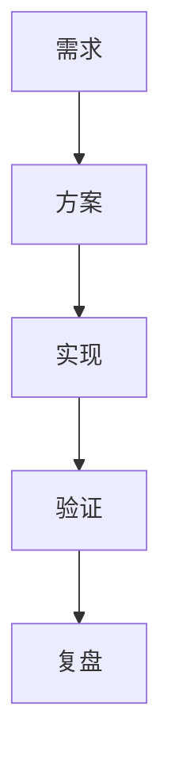

# {{项目名}}

## 目标

## 当前状态

| 项 | 内容 |
| --- | --- |
| 状态 | 构想/进行中/暂停/已完成/归档 |
| 下一步 |  |
| 相关资料 |  |

## 工作流

```mermaid
flowchart TD
    Need[需求] --> Plan[方案]
    Plan --> Build[实现]
    Build --> Verify[验证]
    Verify --> Review[复盘]
```

## 待办

- [ ] 

## 复盘
