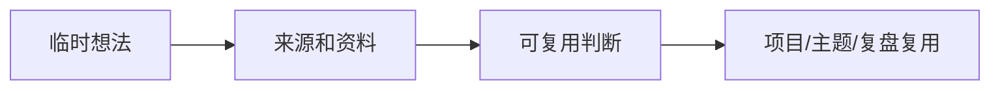

# ZETA

> [!home]+ Zettelkasten Flow
> ZETA 负责把临时输入变成可复用知识。不是所有记录都要变成永久笔记。

> [!info]+ 使用边界
> ZETA 是知识加工流程，不要求所有正文都搬进 `ZETA` 文件夹。主题正文可以继续留在 `20-AI`、`40-知识库`、`60-思维笔记` 等内容库目录。

> [!capture] Fleeting Notes
> [[ZETA/Fleeting Notes]]
>
> 临时想法、片段、未判断去向的内容。

> [!zeta] Literature Notes
> [[ZETA/Literature Notes]]
>
> 外部资料、来源、剪藏、学习材料。

> [!project] Permanent Notes
> [[ZETA/Permanent Notes]]
>
> 长期可复用的判断、主题地图和原则卡片。

## 加工路径

