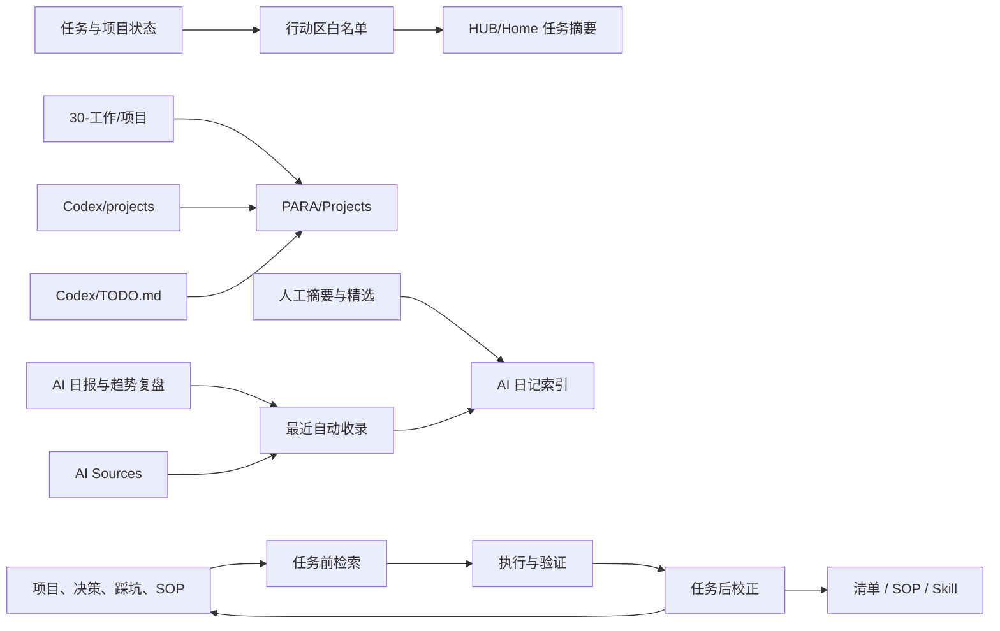

# Obsidian 动态闭环增强设计

## 背景

当前知识库已经具备稳定的目录、首页、项目入口、AI 日记、Codex 持久记忆和治理规范。主要问题不再是缺少结构，而是四条链路没有完全闭合：

1. 首页会把提示词和资料中的复选框识别成行动任务。
2. `PARA/Projects` 与 `Codex/projects` 分别服务人工项目和 AI 项目记忆，缺少统一入口。
3. AI 日记索引主要依靠手工追加，新日报和来源页可能暂时成为孤立内容。
4. Codex 已规定何时读取和写入记忆，但尚未明确任务前召回、任务后校正和经验升级机制。

## 目标

用现有 Obsidian、Dataview 和 Markdown 能力完成一轮小而可回滚的闭环增强：

- 首页只展示真实行动区的任务。
- 项目入口可以看到最近更新的 Codex 项目记忆。
- AI 日记索引自动显示最新日报和来源页，同时保留人工精选摘要。
- Codex 在重要任务前检索历史记忆，任务后校正记忆，并把重复验证的经验升级为清单或 Skill。

## 非目标

- 不新增、移除或配置 Obsidian 插件。
- 不移动、重命名或删除现有笔记。
- 不批量修改 frontmatter、标签或正文。
- 不把 `Codex/projects` 合并进 `30-工作/项目`。
- 不处理根目录当前四个未命名 Base/Canvas 文件。
- 不自动生成新的 Permanent Note、复盘结论或项目状态。

## 方案选择

采用“动态闭环增强”：

- 对经常变化的项目列表和 AI 日记使用 Dataview 动态聚合。
- 对需要长期稳定执行的记忆行为使用 `Codex/AGENTS.md` 明文规则。
- 对首页任务使用路径白名单，而不是不断追加排除项。
- 保留现有人工索引和精选说明，动态视图只负责防止新内容暂时不可见。

没有采用纯静态修补，因为静态链接会继续产生维护滞后；没有采用 QuickAdd/Templater 重度自动化，因为当前问题不需要新增脚本和维护面。

## 详细设计

### 1. Codex 记忆闭环

修改 `Codex/AGENTS.md`：

- 在“启动时”增加任务前检索要求。重要任务需要按相关性读取当前项目页、历史决策、失败案例、检查清单或 Skill。
- 要求在工作说明或最终回复中简短说明本次实际复用了哪些历史记忆；没有匹配记忆时不虚构引用。
- 在“会话收尾”增加结果校正规则：确认历史判断被证实、被推翻还是仍待验证。
- 新增经验升级规则：
  - 首次出现的经验写入最相关项目页。
  - 同类经验第二次出现且仍有效时升级为检查清单或 SOP。
  - 第三次验证有效且适合自动执行时再升级为 Skill、模板或固定规则。
  - 被新证据推翻的结论保留原记录，并明确失效原因与新结论。

该规则只改变记忆工作流，不授权 Codex 在用户未要求时执行破坏性修改或外部写入。

### 2. 首页任务信号

修改 `HUB/Home.md` 中的两个 DataviewJS 区块：

- 把现有“排除部分目录”的逻辑改为“只允许行动区”的路径白名单。
- 允许的任务来源：
  - `Codex/TODO.md`
  - `Codex/projects/`
  - `30-工作/`
  - `DAILY/`
  - `未分类/`
  - `投资/`
- “任务摘要”和“今日焦点”的待办、完成统计使用同一个白名单定义，避免数字与列表口径不一致。
- 继续保留最多六条任务的展示限制。

这会排除 `20-AI/AI提示词库`、`Templates`、`docs`、`SYSTEM`、`00-管理` 和知识资料中的示例复选框，但不会删除这些复选框。

### 3. 统一项目入口

修改 `PARA/Projects.md`：

- 保留现有 `30-工作/项目` 项目入口和维护规则。
- 新增“Codex 项目记忆”区块，明确该区只显示 AI 协作项目的持久状态，不改变正文归属。
- 使用 Dataview 按文件修改时间倒序列出 `Codex/projects` 最近更新的 10 个页面。
- 展示项目链接和更新时间，避免复制项目状态或维护第二份静态清单。
- 增加指向 `Codex/TODO.md` 的跨项目待办入口。

### 4. AI 日记动态防漏

修改 `20-AI/AI日记/00-索引.md`：

- 在主题地图之后增加“最近自动收录”区块。
- 使用两个 Dataview 查询分别显示最近 20 篇日报/趋势复盘和最近 20 篇来源页。
- 查询按 `date` 优先、文件名兜底排序；排除索引页和 Topics 页面。
- 保留现有人工“周度趋势复盘”“日报”“来源归档”清单，不覆盖其中的摘要和精选说明。

动态区解决“新文件先可见”的问题，人工区继续承担“为什么重要”的策展作用。

### 5. 审查与记忆收尾

实施完成后：

- 新建 `00-管理/审查记录/2026-07-25-闭环增强记录.md`，记录目标、改动、验证结果和保留边界。
- 更新 `Codex/projects/Obsidian.md`，记录本轮闭环增强及未处理事项。
- 不修改 `HUB/Outputs`、`HUB/Review` 或 Permanent Note 数量，因为本轮没有产生新的用户判断或真实复用结果。

## 数据流

## 异常与边界处理

- Dataview 未启用时，原有静态项目入口和人工 AI 日记索引仍可使用。
- 某个 Codex 项目缺少 frontmatter 时，项目查询仍以 `file.link` 和 `file.mtime` 工作。
- 行动区中的文档仍可能包含示例复选框；本轮只解决最大的目录级噪声，不引入新的任务属性体系。
- 动态 AI 日记查询只补可见性，不自动判断内容质量，不自动写摘要。
- 所有改动保持 Markdown 可读，不依赖外部服务。

## 验证

完成实施后执行：

1. 检查 `git diff --check`，确认没有空白错误。
2. 检查修改文件的 frontmatter 和代码围栏成对完整。
3. 检查首页两个 DataviewJS 区块使用相同的行动区白名单。
4. 检查 `PARA/Projects.md` 查询只读取 `Codex/projects`，限制为 10 条。
5. 检查 AI 日记动态查询能覆盖现有 `2026-07-24`、`2026-07-25` 日报和来源页。
6. 运行全库 wikilink 扫描，确认没有新增真实断链。
7. 检查 `git status --short`，确认四个未命名文件仍保持原状且未被暂存。

## 成功标准

- 首页任务摘要和任务统计不再读取 AI 提示词库、模板、治理文档和普通知识资料中的复选框。
- `PARA/Projects` 能动态进入最近更新的 Codex 项目记忆和跨项目 TODO。
- 新增 AI 日报或来源页即使未手工追加，也能出现在索引动态区。
- `Codex/AGENTS.md` 明确包含任务前召回、任务后校正和经验升级规则。
- 没有删除、移动、重命名现有文件，没有改变插件配置，没有触碰未命名 Base/Canvas 文件。
