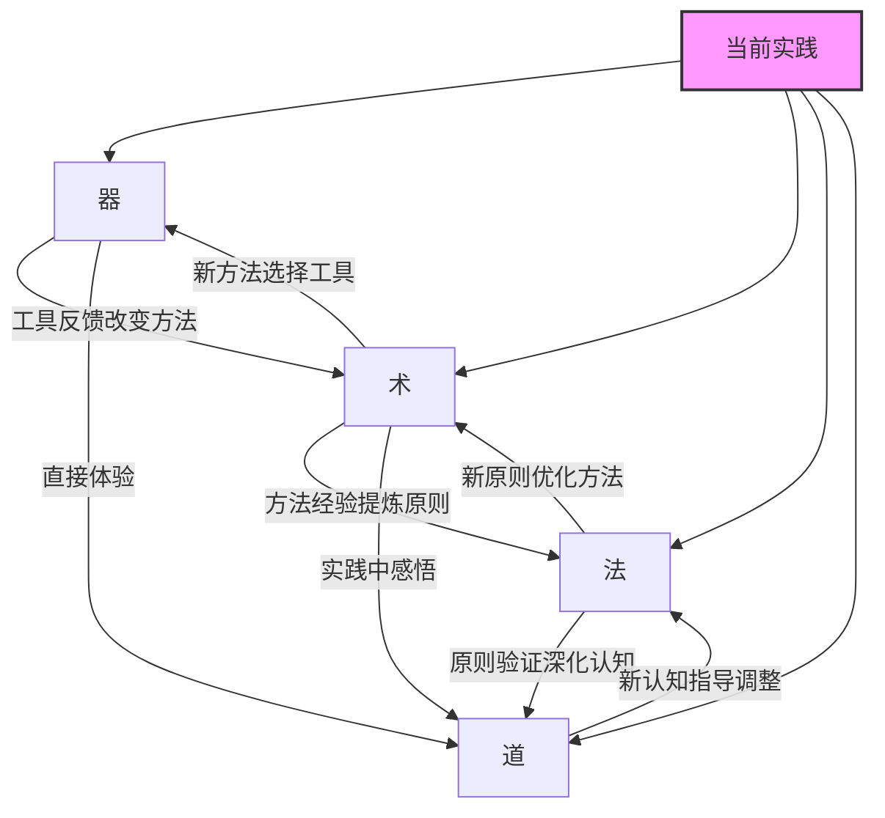

```mermaid
   graph TD
   实践[当前实践] --> 器
   实践 --> 术
   实践 --> 法
   实践 --> 道
   
   器 -- 工具反馈改变方法 --> 术
   术 -- 方法经验提炼原则 --> 法
   法 -- 原则验证深化认知 --> 道
   道 -- 新认知指导调整 --> 法
   法 -- 新原则优化方法 --> 术
   术 -- 新方法选择工具 --> 器
   
   器 -- 直接体验 --> 道
   术 -- 实践中感悟 --> 道
   
   style 实践 fill:#f9f,stroke:#333,stroke-width:2px

```
