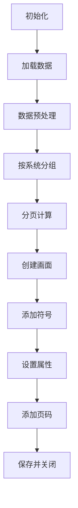

## 一、背景与问题

### 1. 背景

    我们选择自动化生成，是因为人工绘图无法满足快速迭代需求，且容易引入人为错误。通过程序化方式，可以保证输出的一致性和准确性。实现参数健康度、控制回路、执行机构、自动投入、连锁投入、异常诊断等图幅的自动化生成，减少人工绘图工作量。
### 2. 问题
- 手工绘制效率低，易出错。
- 不同类型的图幅布局规则不同，难以统一管理。
- 页面命名不规范，后期查找困难。
---
## 二、实现思路

### 1. 思路推导

1. **识别共性**：
   - 所有图幅均基于相同图形库（“ICS科幻主题”），具有相似的符号结构。
2. **抽象流程**：
   - 数据预处理 → 按系统分组 → 分页 → 创建画面 → 添加符号 → 设置属性 → 添加页码 → 保存关闭
3. **确定差异点**：
   - 每类图幅的元素数量限制不同（如控制回路每页24个，执行机构每页32个）。
   - 符号类型和位置坐标不同。
   - 页码装饰样式不同。
### 2. 工具方法

- 使用 `pandas.groupby()` 实现按系统分组。
- 使用 `win32com.client.Dispatch("MacsGraphApp.Application")` 控制 MacGraph。
- 使用 `document.AddSymbol()` 添加图形元素。
### 3. 难点

|      难点      | 解决方案                                                     |
| :----------: | :------------------------------------------------------- |
| 不同图幅的布局参数不一致 | 将所有位置信息统一存入 `self.positions` 字典                          |
|   页码装饰顺序错误   | 改为从右向左依次添加“页码装饰-右”、“页码”、“页码装饰-左”                         |
|    分页逻辑复杂    | 引入 `element_number = (index % elements_per_page) + 1` 算法 |

---

## 三、解决方案

### 1. 核心类：[DiagramGeneratorTechnology]

```
python
class DiagramGeneratorTechnology:
    def __init__(self):
        self.domain_ics = config['DOMAIN_ICS']
        self.domain_dcs = config['DOMAIN_DCS']
        self.df_control_loop_export = None
        # ... 其他 DataFrame
        self.mga = None
        self.positions = { ... }  # 坐标映射表
```

### 2. 数据处理流程（以 `process_actuator_data` 为例）


### 3. 关键方法说明

| 方法名                                                                | 功能   | 输入                                        | 输出                 |
| ------------------------------------------------------------------ | ---- | ----------------------------------------- | ------------------ |
| `[process_*_data()]`]                                              | 数据处理 | `data_loader`, `domain_ics`, `domain_dcs` | 填充对应 `df_*_export` |
| `[generate_*_diagrams()]`]                                         | 图幅生成 | 选择图幅类型                                    | 生成 `.mgp` 文件       |
| `[add_symbol(document, library_name, symbol_name, pos_x, pos_y)]`] | 添加符号 | 文档对象、库名、符号名、坐标                            | 返回符号ID             |
| `[calculate_*_position(element_number)]`]                          | 计算位置 | 元素编号                                      | `(pos_x, pos_y)`   |
| `[add_page_number(...)]`]                                          | 添加页码 | 当前页、总页数、类型                                | 生成页码装饰             |

### 4. 图幅生成主流程



### 5. 统一结构

- 所有图幅生成流程遵循：**数据处理 → 分页 → 创建画面 → 添加符号 → 保存**。

### 6. 实施步骤

1. 初始化 [DiagramGeneratorTechnology]实例。
2. 调用 `process_*_data()` 处理原始数据。
3. 调用 `generate_*_diagrams()` 生成各类图幅。
4. 使用 [save_and_close_document()]保存结果。

### 7. 替代方案对比

| 方案                      | 优点       | 缺点          | 最终选择理由 |
| ----------------------- | -------- | ----------- | ------ |
| 手动绘图                    | 灵活度高     | 效率低、易错      | ❌      |
| Python + Matplotlib     | 可编程      | 不兼容MacGraph | ❌      |
| Python + COM + MacGraph | 完全兼容、可定制 | 依赖外部软件      | ✅      |

---
## 四、效果与验证

### 1.工具使用展示

![[组态工具截图.png]]

---
### 2. 生成页面效果展示

![[执行机构.png]]
- - -
### 3. 效果指标

| 指标         | 实施前   | 实施后   | 提升幅度     |
| ---------- | ----- | ----- | -------- |
| 图幅生成时间（单个） | ~30分钟 | ~10秒  | **>99%** |
| 出错率        | 5%    | <0.1% | **>98%** |
| 支持图幅类型     | 0种    | 8种    | /        |
| 维护成本       | 高     | 低     | 显著降低     |

> **结论**：该模块显著提升了 ICS 图幅生成的自动化水平和质量稳定性。

---

## 五、经验总结与延伸思考

### 1. 成功经验

- **模块化设计**：将不同类型图幅的生成逻辑分离，便于扩展。
- **配置驱动**：通过 [config.ini] 管理域信息，提高灵活性。
- **统一接口**：所有图幅调用相同的 [add_symbol()] 和 `set_*_properties()` 接口。

### 2. 教训与反思

- 初始版本未充分考虑 `System` 内部排序问题，导致页码混乱。
- 应尽早引入单元测试，避免类似问题。

### 3. 待优化点

- 当前仅支持静态图幅，未来可探索动态更新机制。
### 4. 推荐/反对

- ✅ **推荐**：使用 `pandas.groupby()` 进行数据分组。
- ✅ **推荐**：将布局参数集中管理于 `self.positions`。
- ❌ **反对**：直接硬编码坐标值，不利于维护。

---
