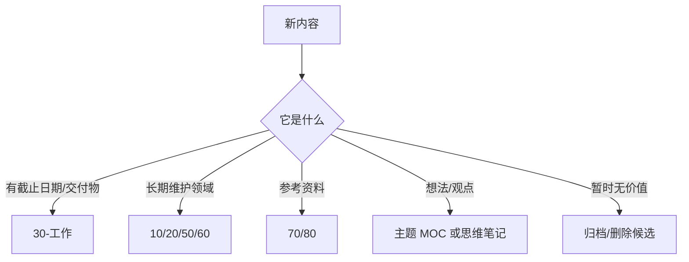

# 收件箱处理台

这页对应 Dusk 的 Mail Box / Inbox 思路。所有不确定去向的内容先进入这里或 `未分类`，再按规则分拣。

新的 Dusk 风格入口见 [[HUB/Inbox]]。

## 分拣规则

## 判断表

| 情况         | 去向             | 动作            |     |
| ---------- | -------------- | ------------- | --- |
| 有明确项目或工作目标 | `30-工作`        | 建项目页或补到项目总览   |     |
| 是技术命令/踩坑   | `10-技术笔记`      | 补场景、命令、注意事项   |     |
| 是 AI 新闻    | `20-AI/AI日记`   | 进入日报或 Topics  |     |
| 是长文/视频/资料  | `80-Clippings` | 保留来源，后续提炼     |     |
| 是长期兴趣      | `60-思维笔记`      | 进入主题地图        |     |
| 暂时判断不了     | `未分类`          | 标记 `待整理`，每周复查 |     |

## 本周原则

- 收件箱只允许短期存在。
- 每次分拣只做一个决定，不顺手重写大段正文。
- 能合并到已有主题，就不要新建重复主题。
