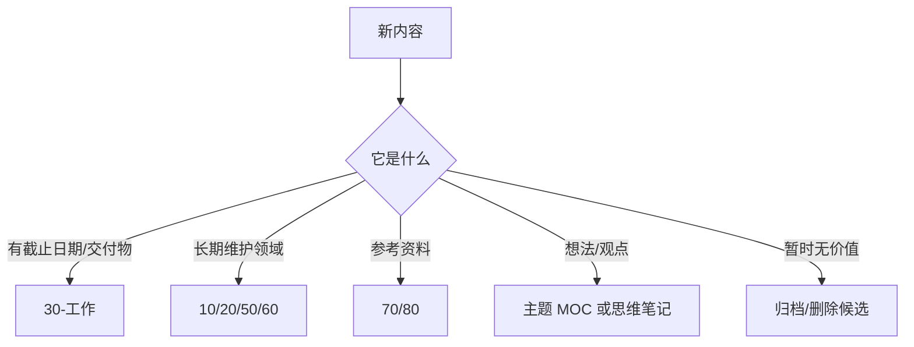

# 收件箱处理台

这页对应 Dusk 的 Mail Box / Inbox 思路。所有不确定去向的内容先进入这里或 `未分类`，再按规则分拣。

新的 Dusk 风格入口见 [[HUB/Inbox]]。

## 分拣规则

## 判断表

| 情况 | 去向 | 动作 |
| --- | --- | --- |
| 有明确项目或工作目标 | `30-工作` | 建项目页或补到项目总览 |
| 是技术命令或踩坑 | `10-技术笔记` | 补场景、命令、注意事项 |
| 是 AI 新闻 | `20-AI/AI日记` | 进入日报或 Topics |
| 是长文、视频或资料 | `80-Clippings` | 保留来源，后续提炼 |
| 是长期兴趣 | `60-思维笔记` | 进入主题地图 |
| 暂时判断不了 | `未分类` | 标记 `待整理`，每周复查 |

## 10 分钟清理流程

1. 先按修改时间从旧到新看。
2. 每条只做一个决定：移动、链接、合并、归档、删除候选。
3. 能链接到现有项目或主题，就不新建新页面。
4. 需要深度整理的内容，放入 [[HUB/Tasks]]，不要在清理时展开。
5. 处理完后确认是否还需要保留 `待整理` 标签。

## 本周原则

- 收件箱只允许短期存在。
- 每次分拣只做一个决定，不顺手重写大段正文。
- 能合并到已有主题，就不要新建重复主题。
- 超过一个月仍无法判断用途的内容，优先归档或删除候选。
